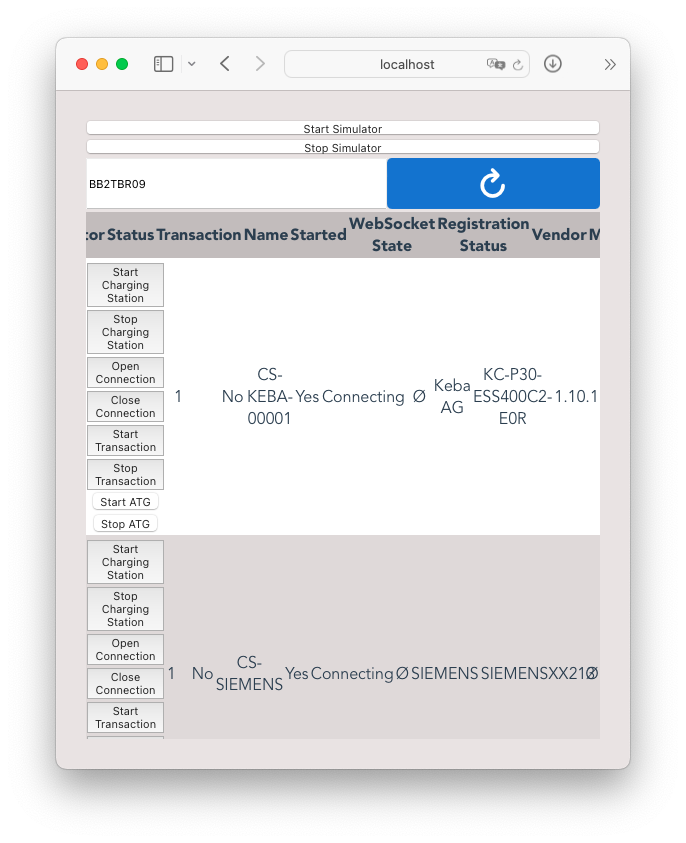

# Web UI

The Web UI code and configuration is in the repository directory [ui/web](./../../ui/web/). Commands execution is relative to that directory.

## Project setup

### Dependencies

```shell
corepack enable
corepack prepare pnpm@latest --activate
pnpm install
```

### Configuration

#### Simulator UI Server Configuration

The simulator UI server must be enabled, use WebSocket transport type and have authentication disabled. The simulator main configuration file should have a `uiServer` section like this:

```json
  "uiServer": {
    "enabled": true,
    "type": "ws",
    "authentication": {
      "enabled": false,
      "type": "basic-auth",
      "username": "admin",
      "password": "admin"
    }
  },
```

See [here](./../../README.md#charging-stations-simulator-configuration) for more details.

#### Web UI configuration

Copy the configuration template [src/assets/config-template.json](src/assets/config-template.json) to `public/config.json`.

### Run

#### Compiles for production and preview locally

```shell
pnpm preview
```

#### Try it out

You can now follow the link displayed in the terminal. The Web UI looks like the following:



1. With the top 2 buttons you can now stop and afterwards start the simulator and inspect the server console for the number of charging stations, e.g. with the default configuration: `Charging stations simulator ... started with 10 charging station(s)`
2. Each charging station is a row in the table below, try "Stop Charging Station" and refresh with the large blue button and see the status Started turns from Yes into No.

### Development

#### Compiles and run for development

```shell
pnpm dev
```

#### Formats files

```shell
pnpm format
```

#### Lints and fixes files

```shell
pnpm lint:fix
```
